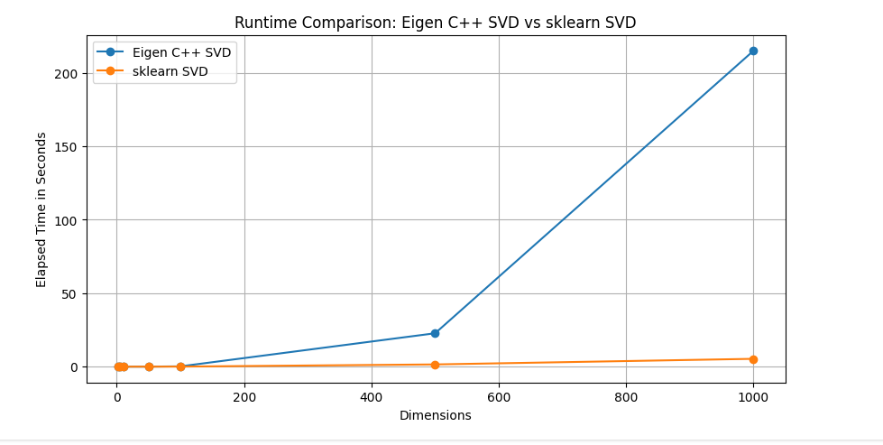

## Comparison of Runtime for Singular Value Decomposition (SVD)

In this analysis, we compare the runtime of Singular Value Decomposition (SVD) implemented in Eigen C++ and sklearn Python libraries for various dataset dimensions. The experiments were conducted on random datasets of different sizes.

### Eigen C++ Implementation

The Eigen C++ implementation utilized the JacobiSVD module for computing SVD. Below are the runtime results for different dataset dimensions:

- **(2, 2)**: Elapsed time: 0 seconds
- **(5, 5)**: Elapsed time: 0 seconds
- **(10, 10)**: Elapsed time: 0 seconds
- **(50, 50)**: Elapsed time: 0.0316364 seconds
- **(100, 100)**: Elapsed time: 0.219676 seconds
- **(500, 500)**: Elapsed time: 22.7468 seconds
- **(1000, 1000)**: Elapsed time: 215.068 seconds

The Eigen C++ implementation exhibits an increase in runtime as the dataset dimensions grow. However, it faces significant performance challenges for larger datasets, possibly due to memory management and computational complexity issues.

### sklearn Python Implementation

The sklearn Python implementation employed the TruncatedSVD module for computing SVD. Here are the runtime results for different dataset dimensions:

- **(2, 2)**: Elapsed time: 0.00887298583984375 seconds
- **(5, 5)**: Elapsed time: 0.00217437744140625 seconds
- **(10, 10)**: Elapsed time: 0.0026166439056396484 seconds
- **(50, 50)**: Elapsed time: 0.011098384857177734 seconds
- **(100, 100)**: Elapsed time: 0.0623478889465332 seconds
- **(500, 500)**: Elapsed time: 1.5306024551391602 seconds
- **(1000, 1000)**: Elapsed time: 5.348968029022217 seconds

The sklearn implementation demonstrates faster runtime across all dataset dimensions compared to the Eigen C++ implementation. It maintains consistent performance even for larger datasets, indicating efficient memory management and algorithmic optimizations.

### Conclusion

In conclusion, the sklearn implementation of SVD exhibits superior runtime performance compared to Eigen C++ across various dataset dimensions. Developers should consider these runtime differences and the specific requirements of their applications when choosing between Eigen C++ and sklearn for SVD computations.
